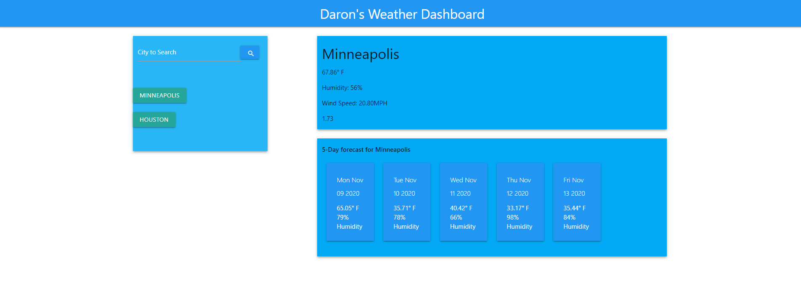

# HW6 Weather API

# Finding the weather!

## Description 

This project is an exercise in trying out new APIs and using user input to make an api call. This was also a personal endeavor in using a CSS framework that wasn't bootstrap. Overall, it went pretty well, but it does not respond well to mobile because materialize does things differently than bootstrap.

## Installation

You can download this repo and open index.html in your favorite browser in order to see the results. You can also feel free to use your favorite text editor to 
take a peek under the hood. 

Additionally, you can skip the downloading and go straight to https://daronschmit.github.io/WeatherAPI/ to see the webpage deployed live. You can then use the inspect tool to see the page's innards in-browser. 

## Usage 

The user inputs a city name into the search field and clicks the search button. The website then uses that information as well as an API key for openweathermap to make calls to get weather information for that city. The website pulls relevant information and uses it to update the html on the screen. every search will append a button to the left, so a user can go back and look at their old searches without typing it again. If the user inputs a city that has already been searched for, the city button will simply be pushed to the top of the list and removed from its previous place. This website will also hold information so that when the user returns, their search history and last city will be loaded for them. 
## Credits

credit to the University of Minnesota coding bootcamp for the starting files. The source is in a private gitlab, so I cannot share it. 
special thanks to Charlie, the instructor, as well as Jake, Paul, and the other TAs for answering so many questions. Thank you to materialize for the css framework, I hope I learn to use it better in the future.

## License

MIT License

Copyright (c) 2020 Daron Schmit

Permission is hereby granted, free of charge, to any person obtaining a copy
of this software and associated documentation files (the "Software"), to deal
in the Software without restriction, including without limitation the rights
to use, copy, modify, merge, publish, distribute, sublicense, and/or sell
copies of the Software, and to permit persons to whom the Software is
furnished to do so, subject to the following conditions:

The above copyright notice and this permission notice shall be included in all
copies or substantial portions of the Software.

THE SOFTWARE IS PROVIDED "AS IS", WITHOUT WARRANTY OF ANY KIND, EXPRESS OR
IMPLIED, INCLUDING BUT NOT LIMITED TO THE WARRANTIES OF MERCHANTABILITY,
FITNESS FOR A PARTICULAR PURPOSE AND NONINFRINGEMENT. IN NO EVENT SHALL THE
AUTHORS OR COPYRIGHT HOLDERS BE LIABLE FOR ANY CLAIM, DAMAGES OR OTHER
LIABILITY, WHETHER IN AN ACTION OF CONTRACT, TORT OR OTHERWISE, ARISING FROM,
OUT OF OR IN CONNECTION WITH THE SOFTWARE OR THE USE OR OTHER DEALINGS IN THE
SOFTWARE.

